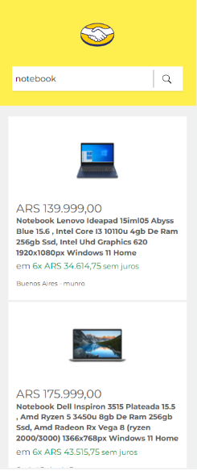

# Meli Challenge

Hola,
Ante todo, gracias por tu tiempo. A continuación te contaremos de que se trata el desafio.
Tu objetivo es crear un buscador de productos de Mercado Libre. Dentro del directorio `app`, encontrarás un proyecto en [Next.js](https://nextjs.org/), donde tendrás que desarrollar tu solución. El ejercicio envuelve una serie de iteraciones; intenta completar cada interación antes de leer la próxima.

Vamos a prestar atención sobre todo a los siguientes puntos:
- Diseño orientado a objetos.
- Diseño testeable.
- Arquitectura modular.
- Código legible y que revele su intención.
- Extensibilidad.
- Principios SOLID aplicados de manera criteriosa.
- Atención a los detalles.


## Iteración 1: Agregar la funcionalidad buscador de productos
### Feature: Buscador de productos

    Como usuario de Mercado Libre
    Quiero buscar productos en base a una palabra o parte de ella
    Para poder comparar y elegir el producto que más me convenga

    Scenario: Un usuario anonimo busca un producto en Mercado Libre
        Dado un usuario anonimo
        Cuando ingresa un texto en el buscador
        Entonces el sistema retorna una lista de productos que contengan el texto, o parte de él, en el título

- El componente deberá cumplir con el siguiente contrato
```javascript
Interface Product {
    id: string;
    title: string;
    price: {
        currency: string;
        amount: string;
        decimals: number;
    };
    installments: {
        quantity: number;
        amount: string;
    };
    address: {
        state_name: string;
        city_name: string;
    };
    picture: string;
    condition: string;
    free_shipping: boolean;
}
```

### Diseños


## Iteración 2: Agregar funcionalidad ordenado de productos
Feature: Ordenar productos

    Como usuario de Mercado Libre
    Quiero ordenar el resultado de búsqueda en base a un criterio
    Para poder comparar y elegir el producto que más me convenga

    Scenario: Un usuario anonimo ordena el resultado de búsqueda en Mercado Libre
        Dado un usuario anonimo
        Cuando selecciona un criterio de ordenamiento
        Entonces el sistema retorna una lista de productos ordenado por el criterio seleccionado
## Iteración 3: Agregar funcionalidad filtro de precio
Feature: Fitrar búsqueda por precio

    Como usuario de Mercado Libre
    Quiero filtrar el resultado de búsqueda por un rango de precio
    Para poder comparar y elegir el producto que más me convenga

    Scenario: Un usuario anonimo aplica un filtro de precio al resultado de búsqueda en Mercado Libre
        Dado un usuario anonimo
        Cuando aplica el filtro de búsqueda
        Entonces el sistema retorna una lista de productos filtrados por el rango de precio seleccionado
## Iteración 4: Mejorar el buscador de productos
Improvement: Ahora la búsqueda de productos debe ser por título o descripción de producto


### Especificaciones técnicas

- El proyecto debe ser reponsive para los siguientes tamaños de pantalla 320, 768, 1280px.
- Crear un store global utilizando [context api](https://reactjs.org/docs/context.html). El mismo debe controlar el listado de productos.
- Unit Tests pruebe la cobertura donde importa, concéntrese en las funciones de desafío
- Usar Typescript

### Deseable

Cosas que pueden ayudar a tu proyecto pero no son obligatorias
- Commit semántico con o sin una herramienta o libraria
- Aplicacion de Server Side Render
- Accesibilidad de los componentes
- HTML semantic
- Patrones CSS
- Seo
- Integration Tests